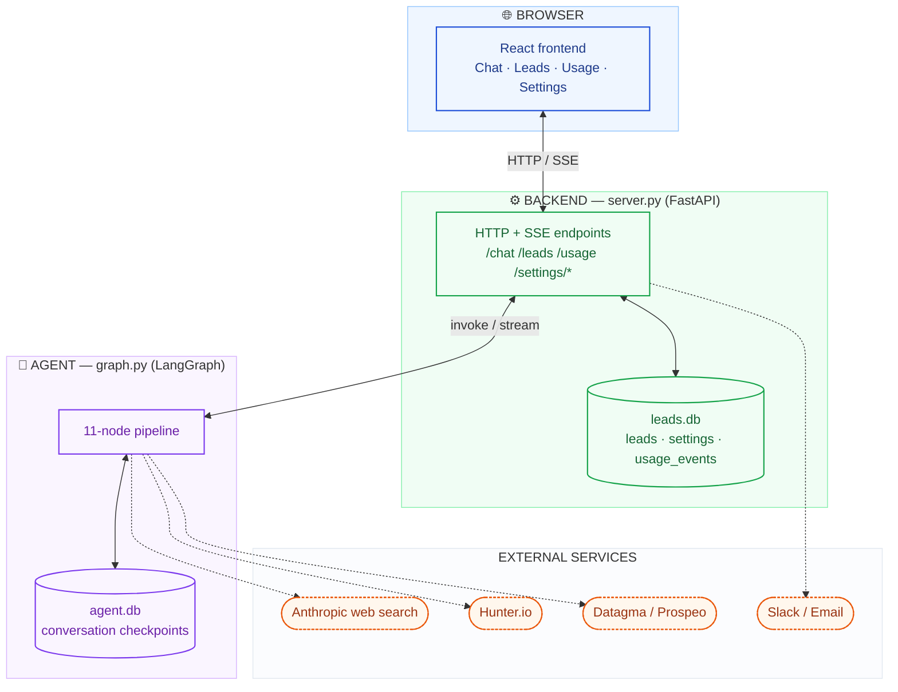
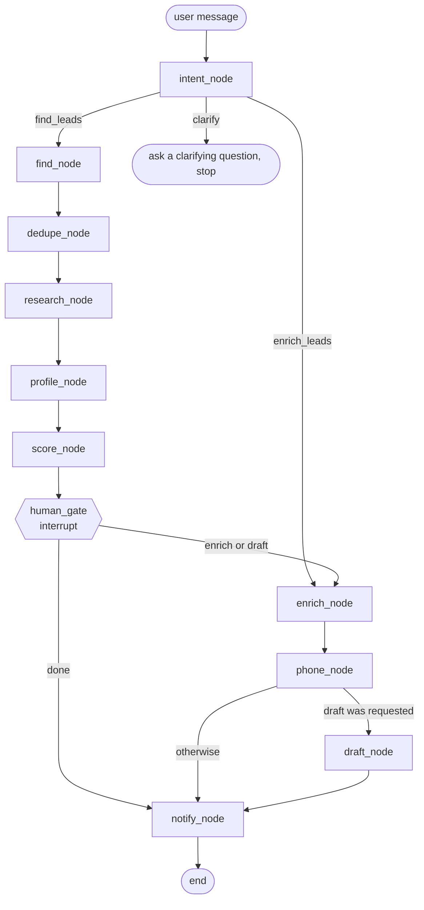

# How the BDR Agent Works

*Two ways to read this: skim the TL;DR and the diagram if you're onboarding onto the
team and just need the shape of the thing. Read the whole thing, code snippets
included, if you want to actually understand it deeply enough to extend it.*

---

## TL;DR (for the team-onboarding pass)

You type a request like *"find VPs of Sales at Series A fintech startups"* into a
chat UI. Behind that one message, an 11-step pipeline runs: it searches the web for
people, removes anyone already in the database, researches their companies, researches
the people themselves, ranks everyone by fit, **pauses and asks you** what to do next,
then (depending on your answer) finds verified emails and phone numbers, optionally
drafts personalized cold-email openers, and finally pings Slack/email with a summary.
Every lead found lands in a searchable database with a CSV import/export flow. There's
also a dashboard showing what all of this is costing you in Claude and Hunter API
spend.

The rest of this document is that same paragraph, expanded to the level of actual
code.

---

## 1. The three layers



Two separate SQLite files, worth keeping straight from the start:
- **`leads.db`** — the durable business data: the `leads` table, app `settings`, and
  the `usage_events` spend ledger.
- **`agent.db`** — LangGraph's own checkpoint storage, i.e. "where each conversation
  currently is." Different lifecycle, different concerns — you could wipe `agent.db`
  and lose no leads, only in-flight conversations.

---

## 2. Concept primer: what is LangGraph actually giving you?

Skip this section if you've read it before. If not: a plain LLM call is stateless —
prompt in, response out, done. Real agent work needs three things a single call can't
give you:

- **Shared memory across steps.** Every node here reads and writes to the same
  `AgentState` — a `TypedDict`, which is just "a dictionary whose expected keys and
  types are declared up front," so your editor and tests can catch typos in key names.
- **Decisions about what happens next.** Some steps are unconditional ("always do B
  after A"). Some depend on data ("if the user wanted `find_leads`, do B; if
  `enrich_leads`, do C"). LangGraph calls the unconditional kind an **edge** and the
  data-dependent kind a **conditional edge**, backed by a plain router function you
  write.
- **Pausing to ask a human something, mid-run, and resuming later — possibly much
  later.** This is the feature most frameworks don't have. LangGraph's `interrupt()`
  suspends the *entire* graph, and a **checkpointer** persists exactly where it
  stopped, so resuming isn't "restart the run" — it's "continue from that exact node
  with that exact state."

This project's actual `AgentState` (from `state.py`):

```python
class AgentState(TypedDict):
    messages: Annotated[Sequence[BaseMessage], add_messages]
    intent: str
    leads: list
    enriched: list
    skipped: list
    gate_decision: str
```

Every node returns a small dict of *just the keys it changed* — e.g. `{"leads": [...]}`
— and LangGraph merges that into the running state. `messages` is special: its
`Annotated[..., add_messages]` type tells LangGraph "don't overwrite this list, append
to it," which is how a multi-turn chat accumulates instead of each turn wiping the
last one.

---

## 3. The graph, exactly as `graph.py` wires it



Compare this to the code in `graph.py` — it's worth doing once, because reading a
`StateGraph` definition is a skill that transfers to every LangGraph project you'll
touch after this one:

```python
g.add_edge(START, "intent_node")
g.add_conditional_edges("intent_node", route_by_intent, {
    "find_leads": "find_node",
    "enrich_leads": "enrich_node",
    "clarify": END,
})
g.add_edge("find_node", "dedupe_node")
g.add_edge("dedupe_node", "research_node")
g.add_edge("research_node", "profile_node")
g.add_edge("profile_node", "score_node")
g.add_edge("score_node", "human_gate")
g.add_conditional_edges("human_gate", route_after_gate, {
    "enrich_node": "enrich_node",
    END: END,
})
g.add_edge("enrich_node", "phone_node")
g.add_conditional_edges("phone_node", route_after_phone, {
    "draft_node": "draft_node",
    END: "notify_node",
})
g.add_edge("draft_node", "notify_node")
```

**A genuinely useful LangGraph subtlety, visible right here:** look at the last
conditional edge. `route_after_phone` returns the *string* `END` (LangGraph's
sentinel for "no more nodes") when a draft wasn't requested — but the mapping dict
says `END: "notify_node"`. That's legal, and it means: `END` here is just a
dictionary *key* your router can return, not a command that actually stops the graph.
What actually happens next is whatever that key is mapped to — in this case,
`notify_node` runs regardless of whether a draft was written. This is exactly how the
graph guarantees `notify_node` is the one place a "run finished" report gets sent, no
matter which path got you there. If you ever add a new branch to this graph, that's
the trick to reach for: map every conditional exit onto a real node instead of letting
paths dead-end differently.

---

## 4. Walking one request through the whole pipeline

Nothing teaches a pipeline like a worked example. Say you type:

> *"Find VPs of Sales at Series A fintech startups"*

**`intent_node`** — one Claude call, using **structured output**: instead of parsing
free text, the model is forced to return a validated `Intent` object
(`category: Literal["find_leads", "enrich_leads", "clarify"]`). Here it returns
`category="find_leads"`. This is a reliability choice worth internalizing: anywhere
this codebase needs a decision rather than prose, it reaches for structured output
(you'll see it again in `score_node`). Ambiguous requests get `clarify` and the graph
stops immediately rather than guessing — a wrong guess here would waste every
downstream API call.

**`find_node`** — binds Claude's server-side web search tool, asks it to return *only*
a JSON array of `{first_name, last_name, company, domain}` (plus `email`/`phone` if
search results happened to surface them). Say it comes back with 8 people.

**`dedupe_node`** — pure Python, no LLM call, and it does two things at once: drops
anyone already sitting in `leads.db` (matched on lowercased `first_name`+`last_name`+
`domain`) *and* drops duplicates within this batch. Say 1 of the 8 was already in your
database from last week — you're left with 7 `leads` and 1 `skipped`.

**`research_node`** — one web-search Claude call **per unique company domain**, not
per lead — if three of your seven leads work at the same startup, that's one research
call, cached and reused across all three. Returns `industry`, `employee_count`,
`location`, and a one-sentence `research_summary`. Unverifiable fields are left `null`
rather than guessed — same discipline as everywhere else in this pipeline.

**`profile_node`** — the person-level counterpart, one search-enabled Claude call
*per lead* (this one can't be cached the way company research can, since every person
is different) — which is why it's capped at 10 leads per run. Returns `linkedin_url`,
`title`, `seniority`, `tenure`, `person_summary`, `talking_points`. Deliberately does
**not** scrape LinkedIn directly — that breaks their ToS and gets IPs banned — it
reads what's already visible in public search results instead.

**`score_node`** — another structured-output call, this time returning a list of
`{index, score 0-100, reason}` for the whole batch in one shot. The prompt explicitly
tells the model to weigh *seniority* alongside *company fit* — a lesson learned from
an earlier version that ranked a great-fit company's junior IC above the actual buyer
at a slightly-less-perfect-fit company. Leads get sorted best-fit-first.

**`human_gate`** — the `interrupt()` point. The graph genuinely pauses here — if you
closed the browser and came back tomorrow, it would resume from exactly this spot,
because the checkpointer (`agent.db`) wrote the full state to disk. You're shown all 7
ranked leads and three options: `enrich`, `draft`, or `done`. Say you reply `"draft"`.

**`enrich_node`** — calls Hunter.io to find/verify each lead's email, tagging every
lead `verified` / `not_found` / `error` (never silently dropped).

**`phone_node`** — provider-agnostic (`PHONE_PROVIDER=datagma|prospeo|none` env var).
Lookup order: any phone `find_node` already captured → a paid provider call keyed on
`linkedin_url` first (best hit rate — this is *why* `profile_node` runs before phone
lookup in the pipeline order) → email → name+company as a last resort. No provider
configured means it costs nothing and does nothing, safely.

**`draft_node`** — because you replied `"draft"`, this runs. One Claude call per
enriched lead *that has an email*, writing a sub-120-word cold-email subject+body,
told to prefer a person-level talking point over a generic company fact, and never to
invent a talking point that wasn't actually researched.

**`notify_node`** — the true end of the graph, reached no matter which branch you
took. If you've turned on `notify_on_run_complete` in Settings, this sends a Slack
message or email summarizing the finished run.

Every lead touched along the way was already saved into `leads.db` as it happened —
not just at the very end — so even if you'd closed the tab right after the gate
appeared, your 7 leads would already be sitting in the Leads Database tab.

---

## 5. The backend: FastAPI, SSE, and where data actually lands

**FastAPI** turns plain Python functions into HTTP endpoints via decorators
(`@app.post("/chat")`), validates request/response bodies against Pydantic models, and
generates interactive API docs for free.

| Endpoint | What it does |
|---|---|
| `POST /chat` | Streams a graph run for a `thread_id` — either starting fresh or resuming a paused gate. |
| `GET /leads` | List saved leads, optional `?status=` filter. |
| `POST /leads/upload` | Bulk CSV import. |
| `POST /leads/enrich` | Run `enrich_node` → `phone_node` directly on existing rows, skipping the whole `intent`→`find`→`research`→`profile`→`score`→`gate` path (these leads are already known and already scored). |
| `GET/PUT /settings/notifications` | Slack webhook / SMTP config, plus `notify_on_gate` and `notify_on_run_complete` toggles. |
| `GET/PUT /settings/usage` | Anthropic admin key (for real billing) + monthly budget. |
| `GET /usage` | Hunter quota, Claude spend (billed or estimated), budget status. |

**Why `/chat` streams instead of returning one blob:** a full run touches up to 8
Claude/API calls in sequence and can take a while. `_stream_chat` iterates
`compiled_graph.stream(..., stream_mode="updates")`, and for every node that
completes, sends a Server-Sent Event:

```python
def _sse(event: str, data: dict) -> str:
    return f"event: {event}\ndata: {json.dumps(data)}\n\n"
```

This is what powers the live graph visualization in the Chat tab (`GraphPanel.jsx`
lighting up each node as it runs, `RunActivity.jsx` showing a running commentary) —
the frontend isn't polling or guessing, it's literally being told "research_node just
finished, here's what it found" in near-real-time.

**Why leads are saved to the database mid-stream, not just at the end:**
`_save_result_to_db` is called from inside the streaming loop after relevant node
updates, not only once at the very end. A user who finds leads and then abandons the
conversation (closes the tab instead of clicking through the gate) hasn't lost that
work — it's already durable.

**Notification timing, two separate triggers, worth not conflating:**
- `server.py`'s `_notify_gate()` fires the moment a run pauses at `human_gate` (checked
  against `notify_on_gate`) — this is "come look, the agent needs your call."
- `graph.py`'s `notify_node` fires at the true end of a run (checked against
  `notify_on_run_complete`) — this is "here's what happened."

These are independently toggleable in Settings because they answer different
questions ("do you want to know when it needs you" vs. "do you want a summary when
it's done").

---

## 6. Notifications and usage tracking

`notifications.py` sends Slack (incoming webhook URL) or email (SMTP), and builds the
human-readable summaries both `notify_node` and the gate-notification path send.
Secrets (`slack_webhook_url`, `smtp_password`) follow a consistent pattern across this
codebase: `GET` endpoints never echo a stored secret back, only a `*_set: bool` flag;
a blank field on a `PUT` means "leave the existing value alone," not "clear it." The
same pattern is reused for the Anthropic admin key in `usage.py` — worth recognizing
as *the* convention for secret-shaped settings anywhere you add a new one.

`usage.py` maintains a local ledger of every paid call (Claude tokens, Hunter
verifications, phone-provider lookups), priced from a static rate table, and blends
that "estimated" number with "billed" real spend if an Anthropic **organization admin
key** is configured (a different, more powerful credential than the key the agent
actually runs on). A `monthly_budget_usd` setting drives a visual meter — currently
display-only, no automatic alert when it's crossed.

---

## 7. The frontend, tab by tab

- **Chat** — the conversational interface, plus the live `GraphPanel` (an SVG of the
  11 nodes, animating the currently-active path) and `RunActivity` (a readable log of
  what each node found). One `thread_id`, generated once per browser and stored in
  `localStorage`, ties every message in a session to the same paused-or-not
  conversation on the backend.
- **Leads Database** — the full `leads` table: name, company, domain, email + status,
  phone + status + source, CSV upload, and select-and-enrich for rows still `pending`.
- **Usage** — spend dashboard: Hunter quota meters (amber under 20%, red under 5%),
  Claude spend (billed/estimated, clearly labeled which), a 30-day chart, budget meter.
- **Settings** — notification channels and toggles, the Anthropic admin key and budget
  input, all following the write-only-secret pattern above.

One detail that matters more than it looks: **CORS is hard-coded** in `server.py` to
`http://localhost:5173` — the exact address Vite's dev server runs on. It works today
purely because frontend and backend share a machine in development. This is the first
thing that silently breaks the moment either one moves to a real, separate URL.

---

## 8. A few design decisions worth being able to explain to someone else

If you're using this doc to onboard a teammate, these are the "why" questions likely
to come up:

- **Why does `intent_node` refuse to guess?** A wrong classification here means every
  downstream Claude/Hunter/phone-provider call runs against the wrong task — the cost
  of asking a clarifying question is one extra turn; the cost of guessing wrong is a
  wasted multi-step, multi-API pipeline run.
- **Why is there a human gate at all, instead of running straight through to enriched,
  drafted leads?** Enrichment and phone lookups cost real money per lead. The gate is
  the checkpoint where a human decides "these are worth spending on" before the
  pipeline spends anything beyond the (cheaper) search/research/profile/score steps.
- **Why does `research_node` cache per-domain but `profile_node` doesn't?** Multiple
  leads can share an employer (same domain → same company facts), but never share a
  person — there's nothing to cache at the individual level.
- **Why no LinkedIn scraping?** ToS violation, gets IPs banned, and is explicitly
  called a deliberate non-choice in the design docs — `profile_node` works from public
  search results instead, a real capability/accuracy tradeoff made on purpose.
- **Why is phone lookup provider-agnostic via an env var instead of hard-coded to
  one vendor?** The original choice (Apollo) turned out to be effectively paywalled
  off the free tier and asynchronous via a webhook this project has no server to
  receive — the env-var indirection is what let the team swap providers without
  touching graph logic.

---

## 9. What this document deliberately doesn't cover

Deployment, hosting, auth, and secrets-in-production are covered in
**`02-production-roadmap.md`** — kept separate on purpose, since "how it works" and
"how we ship it" are different audiences asking different questions, and mixing them
makes both harder to skim.
